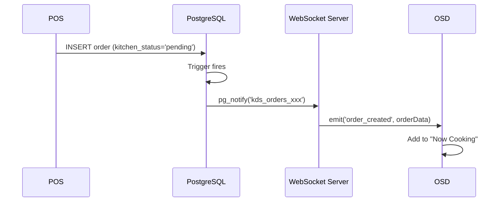
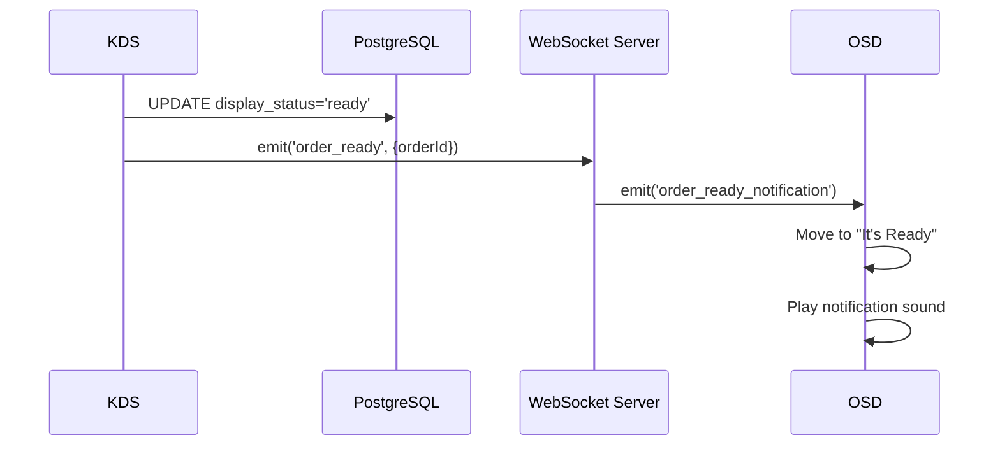
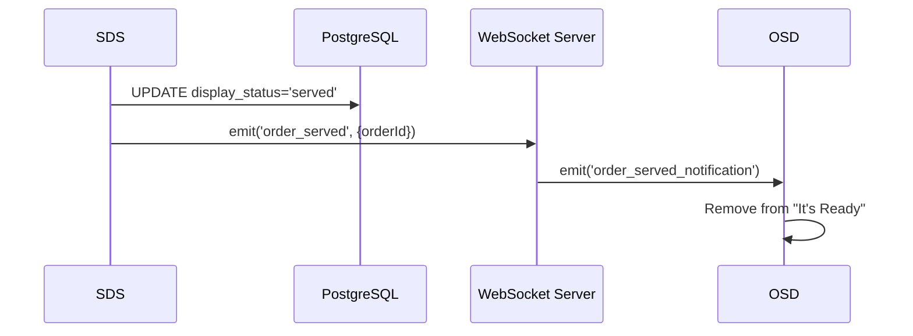

# Order Status Display System (OSD) Requirements Specification

## 1. Overview

### 1.1 Project Name
Order Status Display System (OSD) - Customer-facing Order Status Display

### 1.2 Purpose
Build a display system for fast-food and fast-casual restaurants that allows customers to check their order status in real-time. Implement a "Now Cooking" and "It's Ready" display system similar to those used in burger chain restaurants.

### 1.3 System Architecture Diagram

```
┌─────────────┐    ┌─────────────────┐    ┌─────────────────┐
│     POS     │───▶│   WebSocket     │◀───│      KDS        │
│ (Create     │    │    Server       │    │  (Ready         │
│  Order)     │    │                 │    │   Notification) │
└─────────────┘    └────────┬────────┘    └─────────────────┘
                           │
                           │ WebSocket
                           │
                   ┌───────▼───────┐
                   │      OSD      │
                   │  (Raspberry   │
                   │    Pi +       │
                   │   Display)    │
                   └───────────────┘
                           │
              ┌────────────┴────────────┐
              │                         │
     ┌────────▼────────┐     ┌─────────▼─────────┐
     │   Now Cooking   │     │    It's Ready     │
     │  Order #001     │     │   Order #002      │
     │  Order #003     │     │   Order #005      │
     └─────────────────┘     └───────────────────┘
```

### 1.4 Terminology

| Term | Description |
|------|-------------|
| OSD | Order Status Display - This system |
| POS | Point of Sale - Order entry system |
| KDS | Kitchen Display System - Kitchen display for food preparation |
| SDS | Server Display System - Display for servers/staff |
| Call Number | Customer pickup number |
| Order Number | System-generated order identifier |

---

## 2. Existing System Analysis

### 2.1 WebSocket Server Overview

**Technology Stack:**
- Node.js + Express.js
- Socket.IO v4.7.5
- PostgreSQL (Supabase)
- Redis Streams (optional)
- JWT Authentication

**WebSocket Server URL:** `ws://[host]:9000` (Development) / `ws://[host]:9002` (Production)

### 2.2 Existing Order Status Flow

```
1. POS Creates Order
   └─▶ INSERT into orders table
   └─▶ INSERT into order_items table
   └─▶ kitchen_status = 'pending'
   └─▶ display_status.status = 'pending'

2. PostgreSQL Trigger Fires
   └─▶ pg_notify('kds_orders_<store_id>', payload)

3. WebSocket Server Receives Notification
   └─▶ Broadcasts 'order_created' event to store_{storeId} room

4. KDS Displays and Prepares Order
   └─▶ When cooking complete, updates display_status.status = 'ready'
   └─▶ socket.emit('order_ready', { orderId, timestamp })

5. WebSocket Server Broadcasts
   └─▶ Sends 'order_ready_notification' to store_{storeId} room

6. SDS Receives "Ready" Status
   └─▶ Serves food to customer
   └─▶ Updates display_status.status = 'served'
   └─▶ socket.emit('order_served', { orderId, timestamp })

7. WebSocket Server Broadcasts
   └─▶ Sends 'order_served_notification'
```

### 2.3 Key WebSocket Events

#### Events to Listen (OSD should subscribe to these)

| Event Name | Trigger | Payload |
|------------|---------|---------|
| `order_created` | New order created | `{ orderId, orderNumber, callNumber, items, ... }` |
| `order_ready_notification` | KDS marks order ready | `{ orderId, storeId, ready_by, timestamp, ... }` |
| `order_served_notification` | SDS marks order served | `{ orderId, storeId, served_by, timestamp, ... }` |
| `order_status_update` | Status change | `{ orderId, status, ... }` |

#### Authentication Events

| Event Name | Direction | Payload |
|------------|-----------|---------|
| `authenticate` | Client → Server | `{ storeId, token, deviceId, type: 'osd_device' }` |
| `authenticated` | Server → Client | `{ deviceId, serverTime, storeId, features }` |

### 2.4 Database Schema (Verified from Supabase)

#### orders Table

| Column | Data Type | Nullable | Default | Description |
|--------|-----------|----------|---------|-------------|
| id | uuid | NO | uuid_generate_v4() | Primary key |
| store_id | uuid | NO | - | Store identifier |
| organization_id | uuid | NO | - | Organization identifier |
| user_id | uuid | YES | - | User who created order |
| order_number | varchar | NO | - | Order number (e.g., "ORD-001") |
| call_number | integer | YES | - | Customer pickup number (e.g., 42) |
| table_number | integer | YES | - | Table number for dine-in |
| customer_number | integer | YES | - | Number of customers |
| status | order_status (enum) | YES | 'pending' | Order status |
| kitchen_status | varchar | YES | 'pending' | Kitchen preparation status |
| kitchen_started_at | timestamptz | YES | - | Kitchen start timestamp |
| kitchen_completed_at | timestamptz | YES | - | Kitchen completion timestamp |
| dining_option | uuid | YES | - | FK to dining_options table |
| subtotal | numeric | NO | 0 | Subtotal amount |
| tax_amount | jsonb | YES | '{}' | Tax breakdown |
| discount_amount | jsonb | YES | '{}' | Discount breakdown |
| total | numeric | NO | 0 | Total amount |
| served_at | timestamptz | YES | - | Served timestamp |
| completed_at | timestamptz | YES | - | Order completion timestamp |
| created_at | timestamptz | YES | now() | Creation timestamp |
| updated_at | timestamptz | YES | now() | Last update timestamp |
| split_bill_info | jsonb | YES | - | Split bill information |
| table_session_id | uuid | YES | - | Table session reference |
| coupon_id | uuid | YES | - | Applied coupon |
| manual_discount_total | numeric | NO | 0 | Manual discount total |
| item_coupon_discount_total | numeric | NO | 0 | Item coupon discount |
| order_coupon_discount_total | numeric | NO | 0 | Order coupon discount |
| total_discount | numeric | NO | 0 | Total discount amount |
| receipt_number | numeric | YES | - | Receipt number |
| offline_receipt_number | text | YES | - | Offline receipt number |
| exclude_from_monthly_report | boolean | YES | false | Exclude from reports |

#### order_status Enum Values
```sql
'pending' | 'processing' | 'completed' | 'cancelled' | 'refunded' | 'unpaid'
```

#### order_items Table

| Column | Data Type | Nullable | Default | Description |
|--------|-----------|----------|---------|-------------|
| id | uuid | NO | uuid_generate_v4() | Primary key |
| order_id | uuid | NO | - | FK to orders table |
| product_id | uuid | NO | - | FK to products table |
| quantity | numeric | NO | 1.0 | Item quantity |
| unit_price | numeric | NO | - | Unit price |
| unit_price_tax_included | numeric | YES | - | Unit price with tax |
| tax_rate | numeric | NO | 0 | Tax rate |
| discount_amount | numeric | YES | 0 | Discount amount |
| manual_discount_amount | numeric | NO | 0 | Manual discount |
| item_coupon_discount | numeric | NO | 0 | Item coupon discount |
| order_coupon_discount | numeric | NO | 0 | Order coupon discount |
| line_total | numeric | NO | - | Line total |
| status | text | YES | 'active' | Item status ('active', 'cancelled') |
| display_status | jsonb | YES | - | Display status for KDS/SDS/OSD |
| comment | text | YES | - | Special instructions |
| product_options | text | YES | - | Selected product options |
| coupon_id | uuid | YES | - | Applied coupon |
| refunded_qty | numeric | YES | - | Refunded quantity |
| created_at | timestamptz | YES | now() | Creation timestamp |
| updated_at | timestamptz | YES | now() | Last update timestamp |

#### dining_options Table

| Column | Data Type | Nullable | Default | Description |
|--------|-----------|----------|---------|-------------|
| id | uuid | NO | gen_random_uuid() | Primary key |
| organization_id | uuid | NO | - | Organization identifier |
| name | text | NO | - | Option name (e.g., "Dine In", "Takeaway") |
| description | text | YES | - | Description |
| is_active | boolean | YES | true | Active status |
| active_in_bos | boolean | YES | - | Active in BOS kiosk |
| translations | jsonb | YES | - | Multilingual translations |
| created_at | timestamptz | YES | now() | Creation timestamp |
| updated_at | timestamptz | YES | now() | Last update timestamp |

#### display_status JSONB Structure
```json
{
  "seq": 1,
  "status": "pending|ready|served",
  "ready_at": "2024-01-01T12:00:00Z",
  "served_at": "2024-01-01T12:05:00Z"
}
```

**Status Values:**
- `pending`: Order is being prepared (Now Cooking)
- `ready`: Order is ready for pickup (It's Ready)
- `served`: Order has been picked up/served (Remove from display)

### 2.5 Database Triggers (Verified from Supabase)

The following triggers are configured on the `orders` table for real-time notifications:

#### Active Triggers on orders Table

| Trigger Name | Event | Function | Purpose |
|--------------|-------|----------|---------|
| `kds_orders_change_trigger` | INSERT, UPDATE, DELETE | `notify_kds_order_change()` | Main KDS/OSD notification trigger |
| `broadcast_order_insert_trigger` | INSERT | `broadcast_new_order()` | Broadcast new pending orders |
| `broadcast_order_update_trigger` | UPDATE | `broadcast_order_update()` | Broadcast kitchen_status changes |
| `audit_orders` | INSERT, UPDATE, DELETE | `audit_trigger()` | Audit logging |
| `change_log_orders` | INSERT, UPDATE, DELETE | `change_log_trigger()` | Change logging |

#### notify_kds_order_change() Function Details

This is the primary trigger function for OSD notifications.

**Channel Pattern:**
```
store_<store_id_without_hyphens>
```
Example: `store_abc123def456` (UUID hyphens removed)

**Trigger Conditions:**
- **INSERT**: Always fires, sends full order record
- **UPDATE**: Only fires when these fields change:
  - `kitchen_status`
  - `status`
  - `kitchen_started_at`
  - `kitchen_completed_at`
- **DELETE**: Always fires

**Payload Structure (INSERT):**
```json
{
  "event": "INSERT",
  "table": "orders",
  "order_id": "uuid",
  "store_id": "uuid",
  "organization_id": "uuid",
  "kitchen_status": "pending",
  "status": "pending",
  "timestamp": 1706270400,
  "created_at": "2024-01-26T12:00:00Z",
  "record": { /* full order row */ }
}
```

**Payload Structure (UPDATE):**
```json
{
  "event": "UPDATE",
  "table": "orders",
  "order_id": "uuid",
  "store_id": "uuid",
  "organization_id": "uuid",
  "old_kitchen_status": "pending",
  "new_kitchen_status": "ready",
  "old_status": "pending",
  "new_status": "pending",
  "timestamp": 1706270400,
  "changes": {
    "kitchen_status": { "old": "pending", "new": "ready" },
    "status": { "old": "pending", "new": "pending" }
  },
  "record": { /* full updated order row */ }
}
```

**Important Notes:**
- Payload size is limited to 8KB; larger payloads are truncated
- Channel name uses `regexp_replace` to remove non-alphanumeric characters from store_id

#### broadcast_new_order() Function Details

**Trigger Condition:** Only fires when `kitchen_status = 'pending'`

**Channel:** `order_channel`

**Payload:**
```json
{
  "event": "new_order",
  "order_id": "uuid",
  "store_id": "uuid",
  "kitchen_status": "pending",
  "table": "orders",
  "type": "INSERT"
}
```

#### broadcast_order_update() Function Details

**Trigger Condition:** Only fires when `kitchen_status` changes

**Channel:** `order_channel`

**Payload:**
```json
{
  "event": "order_status_changed",
  "order_id": "uuid",
  "store_id": "uuid",
  "old_kitchen_status": "pending",
  "new_kitchen_status": "ready",
  "table": "orders",
  "type": "UPDATE"
}
```

### 2.6 WebSocket Server Implementation Details (Verified)

#### Existing Device Types

The WebSocket server (`websocket-server/src/server.js`) currently supports these device types:

| Device Type | Value | Room(s) Joined | Status |
|-------------|-------|----------------|--------|
| KDS | `kds` (default) | `store_{storeId}` | Implemented |
| CDS | `cds` | `display_{displayId}`, `store_{storeId}` | Implemented |
| SDS | `sds_device` | `display_{displayId}`, `store_{storeId}` | Implemented |
| POS | `pos_device` | `store_{storeId}`, `all_pos_devices` | Implemented |
| BOS | `bos_device` | `store_{storeId}`, `all_bos_devices` | Implemented |
| **OSD** | `osd_device` | `store_{storeId}` | **NOT IMPLEMENTED** |

#### Authentication Handler Location

File: `websocket-server/src/server.js`
Function: `handleAuthentication(socket, data)` (Line ~938)

```javascript
// Current implementation extracts type with 'kds' as default
const { storeId, displayId, token, deviceId, type = 'kds' } = data;

// Device type validation (lines ~946-965)
if (type === 'cds') { ... }
else if (type === 'sds_device') { ... }
else if (type === 'pos_device') { ... }
else if (type === 'bos_device') { ... }
else { /* default KDS handling */ }
```

#### Implemented Event Handlers

| Event | Handler Function | Description |
|-------|------------------|-------------|
| `order_ready` | `handleOrderReady()` | KDS → broadcasts `order_ready_notification` |
| `order_served` | `handleOrderServed()` | SDS → broadcasts `order_served_notification` |
| `order_status_update` | `handleOrderStatusUpdate()` | Generic status update |
| `pos_order_create` | `handlePosOrderCreate()` | POS → broadcasts `order_created` |
| `bos_order_create` | `handleBosOrderCreate()` | BOS → broadcasts `order_created` |

#### Event Broadcast Details

**order_ready_notification (from handleOrderReady):**
```javascript
{
  orderId: string,
  storeId: string,
  ready_by: 'kds',
  timestamp: ISO string,
  source: 'KDS',
  source_device_id: string,
  target: 'sds_unified',
  // ... additional readyData from KDS
}
```

**order_served_notification (from handleOrderServed):**
```javascript
{
  orderId: string,
  storeId: string,
  served_by: 'sds',
  timestamp: ISO string,
  source: 'SDS',
  source_device_id: string,
  target: 'kds_unified'
}
```

**order_created (from handlePosOrderCreate/handleBosOrderCreate):**
```javascript
{
  // Full order data from POS/BOS
  server_received_at: ISO string,
  _messageId: uuid,
  _timestamp: number,
  _requiresAck: true
}
```

---

## 3. Functional Requirements

### 3.1 Core Functions

#### F-001: Order Status Display
- **Description:** Display order status in two columns: "Now Cooking" and "It's Ready"
- **Priority:** Required
- **Details:**
  - Split screen into two sections (Left: Now Cooking, Right: It's Ready)
  - Display each order as a card
  - Show Call Number or Order Number prominently

#### F-002: Real-time Updates
- **Description:** Update status in real-time via WebSocket
- **Priority:** Required
- **Details:**
  - New order → Add to "Now Cooking"
  - KDS marks Ready → Move from "Now Cooking" to "It's Ready"
  - SDS marks Served → Remove from "It's Ready"

#### F-003: Visual and Audio Notifications
- **Description:** Visual and audio feedback when order is ready
- **Priority:** Recommended
- **Details:**
  - Highlight/flash newly ready cards
  - Optional notification sound
  - Animated card transition

#### F-004: Auto-reconnection and Recovery
- **Description:** Automatic recovery on WebSocket disconnect or app restart
- **Priority:** Required
- **Details:**
  - Detect disconnection and auto-reconnect
  - Fetch latest state from KDS API on reconnect
  - Display connection status in UI

- **Recovery Process (Same as KDS/SDS):**

```
┌─────────────────────────────────────────────────────────────┐
│                    OSD Recovery Flow                        │
├─────────────────────────────────────────────────────────────┤
│                                                             │
│  1. Disconnect/Restart Detected                             │
│     └─▶ Set _wasDisconnected = true                         │
│     └─▶ Record _lastDisconnectedAt timestamp                │
│                                                             │
│  2. Reconnection Successful (authenticated event)           │
│     └─▶ Check _wasDisconnected flag                         │
│     └─▶ If true, trigger data refresh                       │
│                                                             │
│  3. Data Refresh                                            │
│     └─▶ Call KDS API: GET /api/kds/orders                   │
│         ?organization_id={orgId}                            │
│         &store_id={storeId}                                 │
│         &status=pending,ready                               │
│     └─▶ Replace local order list with API response          │
│     └─▶ Re-render both columns                              │
│                                                             │
│  4. Reset Flags                                             │
│     └─▶ Set _wasDisconnected = false                        │
│     └─▶ Resume normal WebSocket event handling              │
│                                                             │
└─────────────────────────────────────────────────────────────┘
```

- **Implementation Reference (from KDS):**

```dart
// WebSocket service - Track disconnect state
bool _wasDisconnected = false;
DateTime? _lastDisconnectedAt;
bool _isRefreshing = false;

// Callback for data refresh
Function()? onDataRefreshRequested;

// On disconnect
void _handleDisconnect() {
  _wasDisconnected = true;
  _lastDisconnectedAt = DateTime.now();
}

// On reconnect (authenticated event)
void _handleAuthenticated() {
  if (_wasDisconnected && !_isRefreshing) {
    _triggerDataRefresh();
  }
}

// Trigger data refresh
void _triggerDataRefresh() {
  _isRefreshing = true;
  onDataRefreshRequested?.call();

  // Reset after debounce
  Future.delayed(Duration(seconds: 1), () {
    _isRefreshing = false;
    _wasDisconnected = false;
  });
}

// In main screen - Register callback
websocketService.onDataRefreshRequested = () async {
  await _fetchOrdersFromApi();  // Calls KDS API
};
```

- **Why KDS API Fetch on Recovery:**
  1. WebSocket does not retain events during disconnect
  2. Orders may have been created, moved to ready, or served
  3. Full API fetch ensures 100% accurate state
  4. Same pattern proven in KDS/SDS implementations

### 3.2 Display Requirements

#### F-005: Order Card Information
- **Description:** Information displayed on each order card
- **Priority:** Required
- **Primary Display Number:** Configurable (see F-009)
  - Call Number (default) - Customer pickup number
  - Table Number - For dine-in table service
  - Order Number - System order identifier
- **Secondary Information:**
  - Dining Option icon (DINE_IN / TAKEAWAY)
  - Wait time (optional)
- **Data Source:** All fields available from KDS API response
  - `call_number` (int) - Customer pickup number
  - `table_number` (int) - Table number for dine-in
  - `order_number` (string) - System order identifier
  - `dining_option` (uuid → name via JOIN) - Dining option

#### F-006: Column Display Rules
| Column | Orders to Display | Max Display Count |
|--------|-------------------|-------------------|
| Now Cooking | `display_status.status = 'pending'` | Configurable (default: 20) |
| It's Ready | `display_status.status = 'ready'` | Configurable (default: 10) |

#### F-007: Display Order
- **Now Cooking:** Oldest first (FIFO)
- **It's Ready:** Most recently ready first (newest at top)

### 3.3 Management Functions

#### F-008: Settings Screen
- **Priority:** Recommended
- **Settings:**
  - Store ID
  - WebSocket Server URL
  - Display Language
  - Notification Sound ON/OFF
  - Display Theme (Color)
  - Fullscreen Mode
  - **Primary Display Number Type** (see F-009)

#### F-009: Configurable Primary Display Number
- **Description:** Allow selection of which identifier to display prominently on order cards
- **Priority:** Required
- **Options:**

| Option | Field | Description | Use Case |
|--------|-------|-------------|----------|
| Call Number | `call_number` | Customer pickup number (e.g., 042) | Fast food, counter pickup |
| Table Number | `table_number` | Dine-in table number (e.g., Table 5) | Table service restaurants |
| Order Number | `order_number` | System order ID (e.g., ORD-001) | General purpose |

- **Default:** Call Number
- **Behavior:**
  - Selected type is displayed large and prominently on each card
  - If selected field is null/empty, fallback to Order Number
  - Setting persists across app restarts (stored locally)

- **UI Implementation:**
```
Settings Screen:
┌─────────────────────────────────────┐
│  Primary Display Number             │
│  ┌─────────────────────────────────┐│
│  │ ○ Call Number (Recommended)     ││
│  │ ○ Table Number                  ││
│  │ ○ Order Number                  ││
│  └─────────────────────────────────┘│
└─────────────────────────────────────┘
```

- **Card Display Example:**
```
Call Number Mode:        Table Number Mode:       Order Number Mode:
┌─────────────┐          ┌─────────────┐          ┌─────────────┐
│             │          │             │          │             │
│     042     │          │   Table 5   │          │  ORD-001    │
│             │          │             │          │             │
│   DINE IN   │          │   DINE IN   │          │   DINE IN   │
│             │          │             │          │             │
└─────────────┘          └─────────────┘          └─────────────┘
```

---

## 4. Non-Functional Requirements

### 4.1 Performance

| Item | Requirement |
|------|-------------|
| Startup Time | Under 30 seconds |
| Screen Update Latency | Under 500ms from WebSocket receipt |
| Animation | Smooth 60fps operation |
| Memory Usage | Stable on Raspberry Pi 4 (4GB) |

### 4.2 Availability

| Item | Requirement |
|------|-------------|
| Uptime | 99%+ during business hours |
| Auto-recovery | Reconnect attempt within 30 seconds of disconnect |
| Offline Display | Maintain last state while disconnected |

### 4.3 Security

| Item | Requirement |
|------|-------------|
| Authentication | JWT token-based device authentication |
| Communication | WSS (WebSocket Secure) recommended |
| Display Data | No customer personal information displayed |

---

## 5. Technical Specifications

### 5.1 Recommended Technology Stack

#### Option A: Flutter (Recommended)
- **Reason:** Same tech stack as existing KDS/SDS, code sharing possible
- **Framework:** Flutter 3.x
- **WebSocket:** socket_io_client package
- **State Management:** Provider or Riverpod

#### Option B: Web (Electron/React)
- **Reason:** If proficient in web technologies
- **Framework:** React + Socket.IO Client
- **Runtime:** Electron or Chromium Kiosk Mode

#### Option C: Python + Kivy
- **Reason:** Native Raspberry Pi, lightweight
- **Framework:** Kivy
- **WebSocket:** python-socketio

### 5.2 Raspberry Pi Specifications

#### Recommended Hardware
- **Model:** Raspberry Pi 4 Model B (4GB RAM or higher recommended)
- **Storage:** 32GB microSD (Class 10)
- **OS:** Raspberry Pi OS (64-bit)
- **Display:** HDMI compatible monitor

#### Flutter on Raspberry Pi Setup
```bash
# 1. Install Flutter SDK
git clone https://github.com/flutter/flutter.git
export PATH="$PATH:`pwd`/flutter/bin"

# 2. Use flutter-pi (elinux)
# https://github.com/nicholascioli/flutter-pi

# 3. Or use flutter-elinux
# https://github.com/aspect-build/flutter-elinux
```

### 5.3 WebSocket Connection Specifications

#### Connection Parameters
```dart
final socket = io(
  'wss://your-websocket-server.com',
  OptionBuilder()
    .setTransports(['websocket'])
    .setAuth({
      'storeId': storeId,
      'token': jwtToken,
      'deviceId': deviceId,
      'type': 'osd_device',
    })
    .build(),
);
```

#### Authentication Flow
```
1. socket.connect()
2. socket.emit('authenticate', authData)
3. socket.on('authenticated') → Authentication successful
4. socket.join('store_{storeId}')
5. Listen for order events
```

### 5.4 Event Handling

```dart
// New order
socket.on('order_created', (data) {
  final order = Order.fromJson(data);
  if (order.displayStatus.status == 'pending') {
    addToNowCooking(order);
  }
});

// Order ready
socket.on('order_ready_notification', (data) {
  final orderId = data['orderId'];
  moveToReady(orderId);
  playNotificationSound();
});

// Order served
socket.on('order_served_notification', (data) {
  final orderId = data['orderId'];
  removeFromReady(orderId);
});
```

---

## 6. Screen Design

### 6.1 Main Screen Layout

```
┌────────────────────────────────────────────────────────────────┐
│                    [Store Name / Logo]                          │
├───────────────────────────┬────────────────────────────────────┤
│                           │                                    │
│      NOW COOKING          │         IT'S READY                 │
│      Preparing Your Order │         Please Pick Up             │
│                           │                                    │
│  ┌─────────┐ ┌─────────┐  │  ┌─────────┐ ┌─────────┐          │
│  │   042   │ │   043   │  │  │   039   │ │   041   │          │
│  │  DINE   │ │  TAKE   │  │  │  DINE   │ │  TAKE   │          │
│  │  3 min  │ │  2 min  │  │  │  READY! │ │  READY! │          │
│  └─────────┘ └─────────┘  │  └─────────┘ └─────────┘          │
│                           │                                    │
│  ┌─────────┐ ┌─────────┐  │                                    │
│  │   044   │ │   045   │  │                                    │
│  │  DINE   │ │  DINE   │  │                                    │
│  │  1 min  │ │  0 min  │  │                                    │
│  └─────────┘ └─────────┘  │                                    │
│                           │                                    │
├───────────────────────────┴────────────────────────────────────┤
│  ● Connected                              [Current Time]       │
└────────────────────────────────────────────────────────────────┘
```

### 6.2 Order Card Design

```
┌─────────────────┐
│                 │
│      042        │  ← Call Number (Large, Bold)
│                 │
│    DINE IN      │  ← Dining Option
│                 │
│    3 min ago    │  ← Wait Time (Optional)
│                 │
└─────────────────┘
```

### 6.3 Color Scheme

| Element | Color |
|---------|-------|
| Background | Dark Gray (#1a1a2e) |
| Now Cooking Column | Orange (#ff6b35) |
| It's Ready Column | Green (#4ecca3) |
| Order Card | White (#ffffff) |
| Ready Highlight | Pulse Animation (Green) |

---

## 7. WebSocket Server Extension

### 7.1 New Device Type Addition

**Status: NOT IMPLEMENTED - Requires Development**

Need to add `osd_device` type to WebSocket Server authentication handler.

#### File to Modify
`websocket-server/src/server.js`

#### Location in Code
Function `handleAuthentication()` around line 946-965, add new condition:

```javascript
// Add after line 958 (after bos_device check)
} else if (type === 'osd_device') {
    if (!storeId || !token) {
        throw new Error('Missing OSD authentication credentials');
    }
}
```

#### Room Join Logic (around line 1004-1016)
Add OSD-specific room handling:

```javascript
// Add after bos_device handling (line 1013)
} else if (type === 'osd_device') {
    socket.join(`store_${storeId}`);
    // OSD is read-only, no need for additional rooms
}
```

#### Response Features (around line 1060-1068)
Add OSD features to authenticated response:

```javascript
// Add to the features ternary chain
: type === 'osd_device'
    ? ['order_updates', 'real_time_notifications', 'heartbeat']
    : ['order_updates', 'heartbeat', 'real_time_notifications']
```

#### Complete Implementation Example
```javascript
// In handleAuthentication() function:

// 1. Validation (add after bos_device check ~line 958)
} else if (type === 'osd_device') {
    if (!storeId || !token) {
        throw new Error('Missing OSD authentication credentials');
    }
}

// 2. Room joining (add after bos_device handling ~line 1013)
} else if (type === 'osd_device') {
    socket.join(`store_${storeId}`);
}

// 3. Features response (update ternary chain ~line 1060)
features: type === 'cds'
    ? ['session_updates', 'cart_updates', 'heartbeat', 'real_time_notifications']
    : type === 'sds_device'
        ? ['order_updates', 'session_updates', 'heartbeat', 'real_time_notifications', 'database_queries']
        : type === 'pos_device'
            ? ['order_create', 'session_updates', 'heartbeat', 'cart_updates', 'pos_notifications']
            : type === 'bos_device'
                ? ['order_create', 'session_updates', 'heartbeat', 'cart_updates', 'kiosk_management', 'self_ordering']
                : type === 'osd_device'
                    ? ['order_updates', 'real_time_notifications', 'heartbeat']
                    : ['order_updates', 'heartbeat', 'real_time_notifications']
```

### 7.2 OSD Initial Data Fetch API

**Status: NOT NEEDED - Reuse Existing KDS API**

OSD does not require a dedicated API endpoint. The existing KDS API provides all necessary data.

#### API Reuse Strategy

OSD reuses the same API as KDS and SDS:

| System | API Endpoint | Status |
|--------|-------------|--------|
| KDS | `/api/kds/orders` | ✅ Existing |
| SDS | `/api/kds/orders` | ✅ Shared with KDS |
| **OSD** | `/api/kds/orders` | ✅ **Reuse KDS API** |

#### Why No Dedicated OSD API

1. **KDS API provides all required fields:**
   - `call_number` - Customer pickup number
   - `table_number` - Table number for dine-in
   - `order_number` - System order identifier
   - `dining_option` - Dining option (DINE_IN/TAKEAWAY)
   - `kitchen_status` - Order status (pending/ready)

2. **SDS precedent:** SDS already successfully reuses the KDS API (`sdsOrders = '/api/kds/orders'`)

3. **Reduced maintenance:** Single API to maintain instead of multiple endpoints

4. **Consistent data:** Same data source ensures consistency across all display systems

#### OSD API Usage

**Endpoint:** `GET /api/kds/orders`

**Base URL:** `https://pos.sciometa.com` (or configured API server)

**Request:**
```
GET /api/kds/orders?organization_id={orgId}&store_id={storeId}&status=pending,ready
```

**Required Parameters:**
| Parameter | Type | Description |
|-----------|------|-------------|
| `organization_id` | UUID | Organization ID |
| `store_id` | UUID | Store ID |
| `status` | string | Comma-separated: `pending,ready` |

**Optional Parameters:**
| Parameter | Type | Description |
|-----------|------|-------------|
| `display_id` | UUID | Not needed for OSD (skip to avoid category filtering) |

**Response Structure:**
```json
{
  "success": true,
  "orders": [
    {
      "id": "uuid",
      "order_number": "ORD-001",
      "call_number": 42,
      "table_number": 5,
      "kitchen_status": "pending",
      "dining_option": "uuid",
      "created_at": "2024-01-01T12:00:00Z",
      "kitchen_completed_at": null,
      "order_items": [ /* ignored by OSD */ ]
    }
  ]
}
```

**OSD Data Extraction:**
```dart
// OSD only uses these fields from the response:
class OsdOrder {
  final String id;
  final String orderNumber;
  final int? callNumber;
  final int? tableNumber;
  final String kitchenStatus;  // 'pending' or 'ready'
  final String? diningOption;
  final DateTime createdAt;
  final DateTime? readyAt;  // kitchen_completed_at
}

// Filter orders by status for display columns:
// - Now Cooking: kitchenStatus == 'pending'
// - It's Ready: kitchenStatus == 'ready'
```

#### Flutter Implementation Example

```dart
// api_endpoints.dart
class ApiEndpoints {
  // OSD uses the same endpoint as KDS/SDS
  static const String osdOrders = '/api/kds/orders';
}

// osd_order_service.dart
Future<List<OsdOrder>> fetchActiveOrders() async {
  final response = await _apiClient.get<Map<String, dynamic>>(
    ApiEndpoints.osdOrders,
    queryParameters: {
      'organization_id': organizationId,
      'store_id': storeId,
      'status': 'pending,ready',  // Both statuses in one call
      // Note: Do NOT include display_id (avoids category filtering)
    },
  );

  if (response.success && response.data != null) {
    final ordersData = response.data!['orders'] as List<dynamic>;
    return ordersData
        .map((json) => OsdOrder.fromJson(json))
        .toList();
  }
  return [];
}
```

### 7.3 Implementation Checklist

| Task | File | Status |
|------|------|--------|
| Add `osd_device` validation | `server.js` line ~958 | Not Implemented |
| Add OSD room joining | `server.js` line ~1013 | Not Implemented |
| Add OSD features response | `server.js` line ~1060 | Not Implemented |
| Reuse KDS API for initial data fetch | OSD Flutter App | ✅ No server changes needed |
| Test OSD authentication | - | Pending |
| Test initial data fetch via KDS API | - | Pending |

---

## 8. Data Flow Details

### 8.1 New Order Flow



### 8.2 Order Ready Flow



### 8.3 Order Served Flow



---

## 9. Implementation Plan

### 9.1 Phase 1: Basic Implementation (MVP)

| Task | Priority |
|------|----------|
| Project Setup | Required |
| WebSocket Connection Implementation | Required |
| Main Screen UI Implementation | Required |
| Event Handling | Required |
| Basic Testing | Required |

### 9.2 Phase 2: Feature Enhancement

| Task | Priority |
|------|----------|
| Notification Sound & Animation | Recommended |
| Settings Screen | Recommended |
| Auto-reconnection Enhancement | Required |
| Raspberry Pi Optimization | Required |

### 9.3 Phase 3: Production Preparation

| Task | Priority |
|------|----------|
| Security Enhancement | Required |
| Performance Optimization | Recommended |
| Documentation | Recommended |
| Production Deployment | Required |

---

## 10. Test Plan

### 10.1 Unit Tests

| Test Item | Content |
|-----------|---------|
| WebSocket Connection | Connect, disconnect, reconnect |
| Event Processing | Correct handling of each event |
| UI Update | Screen update on state change |

### 10.2 Integration Tests

| Test Item | Content |
|-----------|---------|
| POS → OSD | New order appears in Now Cooking |
| KDS → OSD | Ready notification moves to It's Ready |
| SDS → OSD | Served notification removes from display |

### 10.3 Load Tests

| Test Item | Criteria |
|-----------|----------|
| Concurrent Orders | Stable display of 50+ orders |
| Continuous Operation | Stable operation for 24+ hours |
| Memory Leak | No memory increase over extended operation |

---

## 11. Appendix

### 11.1 Reference Resources

- [Existing KDS Source Code](../../order_sys/kds/flutter_app/)
- [Existing SDS Source Code](../../order_sys/sds/flutter_app/)
- [WebSocket Server Source Code](../../websocket-server/)
- [Flutter on Raspberry Pi](https://github.com/nicholascioli/flutter-pi)

### 11.2 Related Documents

- KDS WebSocket Architecture: `order_sys/kds/flutter_app/DATABASE_TRIGGERS_WEBSOCKET_ARCHITECTURE.md`
- WebSocket Server README: `websocket-server/README.md`

### 11.3 Glossary

| Term | Description |
|------|-------------|
| Order Status Display | Customer-facing display showing order preparation status |
| Now Cooking | Orders currently being prepared |
| It's Ready | Orders ready for customer pickup |
| Call Number | Number used to call customers for pickup |
| Kitchen Status | Status of order preparation in kitchen |

---

## 12. Change History

| Version | Date | Changes | Author |
|---------|------|---------|--------|
| 1.0 | 2026-01-26 | Initial creation | Claude |
| 1.1 | 2026-01-26 | Updated to English, verified DB schema from Supabase | Claude |
| 1.2 | 2026-01-26 | Added Section 2.5 (DB Triggers), Section 2.6 (WebSocket Server Details), expanded Section 7 with implementation details and checklist | Claude |
| 1.3 | 2026-01-26 | Enhanced F-005 with call_number/table_number/order_number display options, added F-009 (Configurable Primary Display Number) with settings UI mockup | Claude |
| 1.4 | 2026-01-26 | Section 7.2: Changed from dedicated OSD API to reusing existing KDS API (`/api/kds/orders`). SDS already uses this pattern. Updated implementation checklist. | Claude |
| 1.5 | 2026-01-26 | F-004: Added detailed recovery process for disconnect/restart scenarios. Includes KDS API fetch on reconnect, same pattern as KDS/SDS. | Claude |

---

## 13. Approval

| Role | Name | Date | Signature |
|------|------|------|-----------|
| Project Manager | | | |
| Technical Lead | | | |
| Customer Representative | | | |
